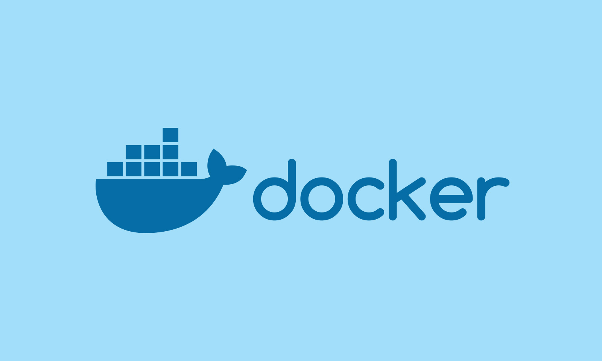

# PRACTICA ENTREGABLE DOCKER

## ¿Qué es Docker?

Docker es un software que nos permite crear contenedores, facilita la miGracion entre diferentes plataformas y garantiza su funcionamiento completo, asi evitando cualquier tipo de posible problema de dependencia entre versiones de software. Su funcionamiento ser basa en compartir un único sistema operativo en la máquina que lo hospeda.

## ¿Qué es Docker Compose?

Docker Compose es una herramienta que nos permitirá definir y ejecutar múltiples aplicaciones utilizando contenedores, utilizaremos ficheros en formato YAML, que nos servirán para definir la configuración de la aplicación en cuestión. De esta manera podemos, con un solo comando, crear e iniciar los servicios configurados en estos ficheros.

