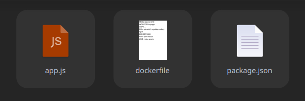

# PRACTICA ENTREGABLE DOCKER

## ¿Qué es Docker?

Docker es un software que nos permite crear contenedores, facilita la miGracion entre diferentes plataformas y garantiza su funcionamiento completo, asi evitando cualquier tipo de posible problema de dependencia entre versiones de software. Su funcionamiento ser basa en compartir un único sistema operativo en la máquina que lo hospeda.


## ¿Qué es Docker Compose?

Docker Compose es una herramienta que nos permitirá definir y ejecutar múltiples aplicaciones utilizando contenedores, utilizaremos ficheros en formato YAML, que nos servirán para definir la configuración de la aplicación en cuestión. De esta manera podemos, con un solo comando, crear e iniciar los servicios configurados en estos ficheros.


## Práctica


### Propósito

En esta práctica vamos a ver como crear un docker-compose que inicie 3 contenedores conectados entre si con la misma red.

- Un contenedor desde un dockerfile con una imagen de alpine (Una aplicacion web de prueba para ver el funcionamiento).

- Otro contenedor basada en la version 2.20.1 de la imagen de prometheus. (Registra métricas en tiempo real en una base de datos).

- Finalmente un contenedor con la version 7.1.5 de la imagen de grafana. (Permite crear cuadros de mando y gráficos a partir de múltiples fuentes).

### Crear un contenedor con Docker Compose apartir de un DockerFile

Este servicio se encargará de arrancar un contenedor (myapp_practica) en el que, partiendo de un Dockerfile, se pondrá en marcha un servidor express muy sencillo (con un app.js y un package.json).

- Partirá de una imagen de node (versión alpine3.10)
```
FROM alpine:3.10
```

- Establecerá un directorio de trabajo “myapp” donde residirá el código de la aplicación. 
```
WORKDIR /myapp
```

- Expondrá el puerto publicado por el servidor express. 
```
EXPOSE 3000
```

- Ejecutará como comando la instrucción necesaria para arrancar el servidor express. 
```
CMD node app.js
```

Esta sera la [ubicacion](https://github.com/Tonomolla6/Metrics_Prometheus_Grafana_Nodejs/src) donde esta el DockerFile.



Dockerfile con las exigencias añadidas anteriormente

```
FROM alpine:3.10
WORKDIR /myapp
COPY . .
RUN apk add --update nodejs npm
EXPOSE 3000
RUN npm install
CMD node app.js
```

Por otra parte, este servicio asociado a la aplicación, se publicará en el puerto 83 y pertenece a una red común a todos los servicios denominada “network_practica” 
