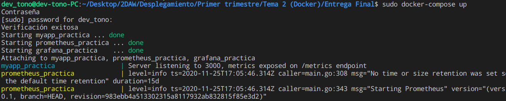
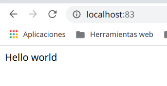
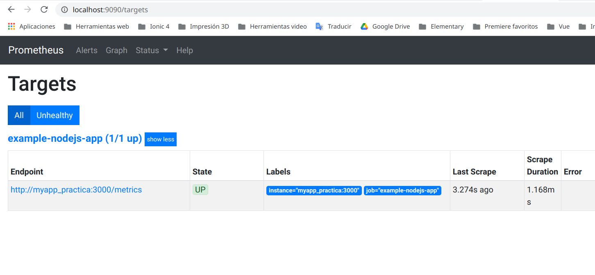
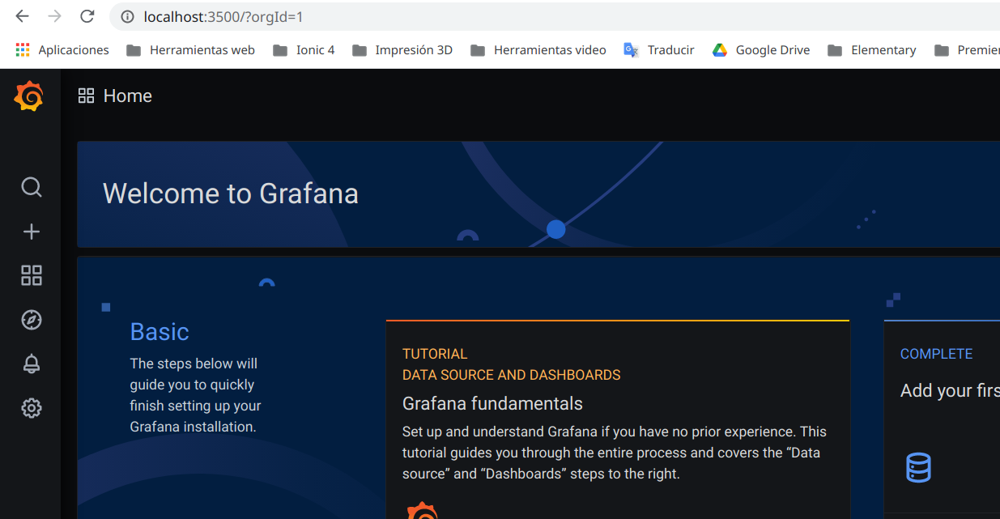
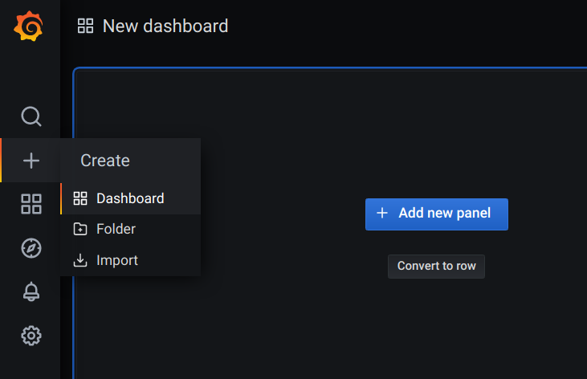
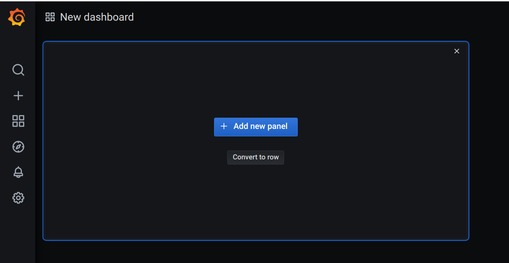

# PRACTICA ENTREGABLE DOCKER


## ¿Qué es Docker?
Docker es un software que nos permite crear contenedores, facilita la miGracion entre diferentes plataformas y garantiza su funcionamiento completo, asi evitando cualquier tipo de posible problema de dependencia entre versiones de software. Su funcionamiento ser basa en compartir un único sistema operativo en la máquina que lo hospeda.

## ¿Qué es Docker Compose?

Docker Compose es una herramienta que nos permitirá definir y ejecutar múltiples aplicaciones utilizando contenedores, utilizaremos ficheros en formato YAML, que nos servirán para definir la configuración de la aplicación en cuestión. De esta manera podemos, con un solo comando, crear e iniciar los servicios configurados en estos ficheros.

## Práctica

### Propósito

En esta práctica vamos a ver como crear un docker-compose que inicie 3 contenedores conectados entre si con la misma red.

- Un contenedor desde un dockerfile con una imagen de alpine (Una aplicacion web de prueba para ver el funcionamiento).

- Otro contenedor basada en la version 2.20.1 de la imagen de prometheus. (Registra métricas en tiempo real en una base de datos).

- Finalmente un contenedor con la version 7.1.5 de la imagen de grafana. (Permite crear cuadros de mando y gráficos a partir de múltiples fuentes).

### Crear un contenedor con Docker Compose apartir de un DockerFile

Este servicio se encargará de arrancar un contenedor (myapp_practica) en el que, partiendo de un Dockerfile, se pondrá en marcha un servidor express muy sencillo (con un app.js y un package.json).

- Partirá de una imagen de node (versión alpine3.10)
```dockerfile
FROM alpine:3.10
```

- Establecerá un directorio de trabajo “myapp” donde residirá el código de la aplicación. 
```dockerfile
WORKDIR /myapp
```

- Expondrá el puerto publicado por el servidor express. 
```dockerfile
EXPOSE 3000
```

- Ejecutará como comando la instrucción necesaria para arrancar el servidor express. 
```dockerfile
CMD node app.js
```

Esta sera la [ubicacion](https://github.com/Tonomolla6/Metrics_Prometheus_Grafana_Nodejs/src) donde esta el DockerFile.


app.js
```javascript
const client = require('prom-client');
const express = require('express');
const server = express();

const collectDefaultMetrics = client.collectDefaultMetrics;
collectDefaultMetrics({ timeout: 5000 });

const counterHomeEndpoint = new client.Counter({
    name: 'counterHomeEndpoint',
    help: 'The total number of processed requests'
});

const counterMessageEndpoint = new client.Counter({
    name: 'counterMessageEndpoint',
    help: 'The total number of processed requests to get endpoint'
});

server.get('/', (req, res) => {
    counterHomeEndpoint.inc();
    res.send('Hello world\n');
});

server.get('/message', (req, res) => {
    counterMessageEndpoint.inc();
    res.send('Message endpoint\n');
});

server.get('/metrics', (req, res) => {
   res.set('Content-Type', client.register.contentType);
   res.end(client.register.metrics());
});

console.log('Server listening to 3000, metrics exposed on /metrics endpoint');
server.listen(3000);
```

package.json
```json
{
  "name": "myapp",
  "version": "1.0.0",
  "description": "",
  "main": "index.js",
  "scripts": {
    "test": "echo \"Error: no test specified\" && exit 1"
  },
  "author": "",
  "license": "ISC",
  "dependencies": {
    "express": "^4.17.1",
    "prom-client": "^12.0.0",
    "response-time": "^2.3.2"
  }
}
```
Dockerfile con las exigencias añadidas anteriormente

```dockerfile
FROM alpine:3.10
WORKDIR /myapp
COPY . .
RUN apk add --update nodejs npm
EXPOSE 3000
RUN npm install
CMD node app.js
```

Por otra parte, este servicio asociado a la aplicación, se publicará en el puerto 83 y pertenece a una red común a todos los servicios denominada “network_practica” 

El servicio en docker compose quedaria asi:

```yaml
version: "3"
services:
  myapp_practica_service:
    container_name: myapp_practica
    build: ./src/
    ports:
      - "83:3000"
    networks:
      network_practica:
networks:
  network_practica:
    external: true
```

### Crear un contenedor con Docker Compose a partir de una imagen (Prometheus)

Prometheus es una aplicación que nos permite recoger métricas de una aplicación en tiempo real. Como veréis en el ejemplo de app.js, se incluye una dependencia en el código (prom-client) que permite crear contadores de peticiones que podemos asociar fácilmente a nuestros endpoints de manera que podemos saber cuántas veces se ha llamado a una función de nuestra api. 
En nuestro caso, el servicio de prometheus se encargará de arrancar en el puerto 9090 de nuestro host un contenedor (prometheus_practica) basado en la imagen prom/prometheus:v2.20.1. Para poder configurar correctamente este servicio, será necesario realizar además dos acciones: 

- Copiar el fichero adjunto prometheus.yml al directorio /etc/prometheus del contenedor 
```yaml
volumes:
  - ./prometheus/prometheus.yml:/etc/prometheus/prometheus.yml
```

- Ejecutar el comando --config.file=/etc/prometheus/prometheus.yml 
```yaml
command: --config.file=/etc/prometheus/prometheus.yml
```

Por supuesto, para que este servicio funcione correctamente, el servicio responsable de arrancar la aplicación debe ejecutarse antes y el servicio deberá pertenecer a la red común “network_practica”. 

Esta sera la [ubicacion](https://github.com/Tonomolla6/Metrics_Prometheus_Grafana_Nodejs/prometheus) donde esta el archivo prometheus.yml.

prometheus.yml
```yml
global:
  scrape_interval: 5s
  evaluation_interval: 30s
scrape_configs:
  - job_name: "example-nodejs-app"
    honor_labels: true
    static_configs:
      - targets: ["myapp_practica:3000"]
```
El servicio en docker compose quedaria asi:

```yml
  prometheus_practica_service:
    container_name: prometheus_practica
    image: prom/prometheus:v2.20.1
    ports:
      - "9090:9090"
    networks:
      network_practica:
    volumes:
      - ./prometheus/prometheus.yml:/etc/prometheus/prometheus.yml
    command: --config.file=/etc/prometheus/prometheus.yml
    depends_on:
     - myapp_practica_service
```

### Crear un contenedor con Docker Compose a partir de una imagen (Grafana)
Este servicio será el encargado de graficar todas las métricas creadas por el servicio de Prometheus. Por tanto, siempre arrancará tras él. En nuestro caso, el servicio de grafana se encargará de arrancar en el puerto 3500 de nuestro host un contenedor (grafana_practica) basado en la imagen grafana/grafana:7.1.5 que, además, se caracterizará por: 

Establecer las variables de entorno necesarias para: 

- Deshabilitar el login de acceso a Grafana 
```yaml
GF_AUTH_DISABLE_LOGIN_FORM: "true"
```

- Permitir la autenticación anónima 
```yaml
GF_AUTH_ANONYMOUS_ENABLED: "true"
```

- Que el rol de autenticación anónima sea Admin
```yaml
GF_AUTH_ANONYMOUS_ORG_ROLE: Admin
```

- Que instale el plugin grafana-clock-panel 1.0.1 
```yaml
GF_INSTALL_PLUGINS: grafana-clock-panel 1.0.1
```

Pertenece a la red común “network_practica” 
```yaml
networks:
  network_practica:
```

Dispondrá de un volumen nombrado (myGrafanaVol) que permitirá almacenar los cambios en el servicio ya que se asociará con el directorio /var/lib/grafana 
```yaml
    volumes:
      - 'myGrafanaVol:/var/lib/grafana/'
volumes:
  myGrafanaVol:
```

Esta sera la [ubicacion](https://github.com/Tonomolla6/Metrics_Prometheus_Grafana_Nodejs/grafana) donde esta el archivo datasources.yml.

datasources.yml
```yml
apiVersion: 1
datasources:
  - name: Prometheus
    type: prometheus
    access: proxy
    orgId: 1
    url: prometheus_practica:9090
    basicAuth: false
    isDefault: true
    editable: true
```

El servicio en docker compose quedaria asi:
```yaml
  grafana_practica_service:
    container_name: grafana_practica
    image: grafana/grafana:7.1.5
    ports:
      - "3500:3000"
    networks:
      network_practica:
    environment:
      GF_AUTH_DISABLE_LOGIN_FORM: "true"
      GF_INSTALL_PLUGINS: grafana-clock-panel 1.0.1
      GF_AUTH_ANONYMOUS_ENABLED: "true"
      GF_AUTH_ANONYMOUS_ORG_ROLE: Admin
    volumes:
      - 'myGrafanaVol:/var/lib/grafana/'
      - './grafana/datasources.yml:/etc/grafana/provisioning/datasources/datasources.yml'
    depends_on:
     - prometheus_practica_service

volumes:
  myGrafanaVol:
```
Finalmente el docker-compose.yml quedaria asi:

```yml
version: "3"
services:
  myapp_practica_service:
    container_name: myapp_practica
    build: ./src/
    ports:
      - "83:3000"
    networks:
      network_practica:

  prometheus_practica_service:
    container_name: prometheus_practica
    image: prom/prometheus:v2.20.1
    ports:
      - "9090:9090"
    networks:
      network_practica:
    volumes:
      - ./prometheus/prometheus.yml:/etc/prometheus/prometheus.yml
    command: --config.file=/etc/prometheus/prometheus.yml
    depends_on:
     - myapp_practica_service

  grafana_practica_service:
    container_name: grafana_practica
    image: grafana/grafana:7.1.5
    ports:
      - "3500:3000"
    networks:
      network_practica:
    environment:
      GF_AUTH_DISABLE_LOGIN_FORM: "true"
      GF_INSTALL_PLUGINS: grafana-clock-panel 1.0.1
      GF_AUTH_ANONYMOUS_ENABLED: "true"
      GF_AUTH_ANONYMOUS_ORG_ROLE: Admin
    volumes:
      - 'myGrafanaVol:/var/lib/grafana/'
      - './grafana/datasources.yml:/etc/grafana/provisioning/datasources/datasources.yml'
    depends_on:
     - prometheus_practica_service

volumes:
  myGrafanaVol:

networks:
  network_practica:
    external: true
```

Ejecutamos para iniciar los contenedores y establecer la conexion.
```sh
docker-compose up
```


## Verificacion de la instalacion
Verificar que, tras implementar todo lo necesario, lo siguiente: 
- Se accede correctamente a la aplicación que se ejecuta en el contenedor a través del puerto 83 



- Se accede correctamente a Prometheus en el puerto 9090 y que en el apartado Status -> Targets se muestra el acceso correcto a las métricas capturadas en la app.



- Se accede correctamente a la aplicación de Grafana en el puerto 3500 y se puede crear un nuevo dashboard para poder incluir paneles en los que mostrar las métricas recogidas en la app.

Vamos a añadir dos graficas de los endpoints de la app para ver como funciona:



Creamos un dashboard:



Añadimos un panel nuevo:



Para que se muestren los endpoints le damos a Metrics > (El endpoint que queremos registrar).


Hacemos algunas pruebas a los endpoints de nuestra aplicacion /metrics /message
Podemos observar las peticiones.


